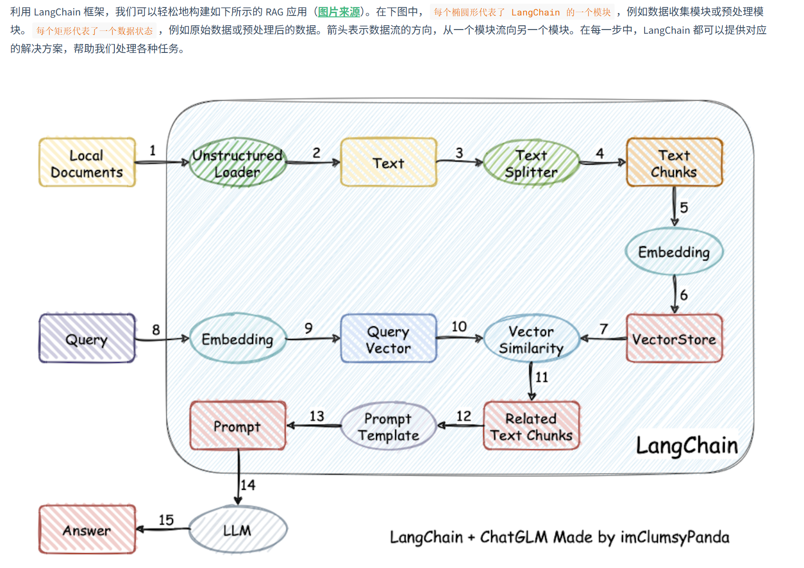

# 第一章：大模型应用开发基础

### 1. 大型语言模型 (LLM) 概览

#### 1.1 核心概念

- **定义**：LLM（Large Language Model）是基于深度学习（通常是 Transformer 架构），包含数百亿甚至数千亿参数，旨在理解和生成人类语言的人工智能模型。
- **本质**：通过“预测下一个词”的训练方式，将世界知识压缩到模型参数中。
- **代表模型**：
  - **国外**：GPT 系列 (OpenAI), LLaMA (Meta), Claude (Anthropic), Gemini (Google)。
  - **国内**：DeepSeek (深度求索), 通义千问 (阿里), 文心一言 (百度), GLM (智谱)。

#### 1.2 关键特点与“涌现”能力

与传统模型相比，LLM 在规模扩大后展现出 **Scaling Law**（性能随规模增长）和 **涌现能力**（量变引起质变）：

1. **上下文学习 (In-Context Learning)**：无需额外训练，仅通过提示（Prompt）中的示例即可学习并执行任务。
2. **指令遵循 (Instruction Following)**：能够理解并执行自然语言描述的新任务指令。
3. **思维链 (Chain of Thought, CoT)**：通过展示推理步骤，解决复杂的逻辑或数学问题。

### 2. 检索增强生成 (RAG) 【重点】

#### 2.1 什么是 RAG

**RAG (Retrieval-Augmented Generation)** 是一种将检索与生成相结合的技术架构。它通过从外部知识库检索相关信息，作为上下文输入给 LLM，从而指导模型生成更精准的答案。

#### 2.2 解决的核心问题

RAG 主要解决了 LLM 自身的以下局限：

- **幻觉问题**：减少一本正经胡说八道的情况。
- **知识滞后**：LLM 训练数据是静态的，RAG 可实时外挂最新数据。
- **私有数据匮乏**：赋予 LLM 访问企业或个人私有知识库的能力。
- **可追溯性**：生成的答案可以找到引用的原文出处。

#### 2.3 RAG 工作流程

一个标准的 RAG 流程包含四个阶段：

1. **数据处理**：清洗原始数据 -> 切片 -> 向量化 -> 存入向量数据库。
2. **检索 (Retrieve)**：将用户问题向量化 -> 在数据库中匹配最相似的片段 (Top K)。
3. **增强 (Augment)**：将检索到的片段与用户问题组合，构建包含上下文的 Prompt。
4. **生成 (Generate)**：将增强后的 Prompt 输入 LLM，生成最终回答。

#### 2.4 RAG vs Finetune (微调)

| **维度**     | **RAG (检索增强)**               | **Finetune (微调)**          |
| ------------ | -------------------------------- | ---------------------------- |
| **知识更新** | 极快 (更新数据库即可)            | 慢 (需重新训练)              |
| **适用场景** | 动态数据、私有知识库、需准确溯源 | 学习特定领域术语、风格、格式 |
| **成本**     | 较低 (主要在推理和存储)          | 较高 (训练算力昂贵)          |
| **可解释性** | 高 (可查引文)                    | 低 (黑盒)                    |

### 3. LangChain 开发框架 【重点】

#### 3.1 简介

**LangChain** 是目前最流行的 LLM 应用开发框架。它充当了“胶水”的角色，将 LLM 与外部数据、计算能力和环境交互连接起来，极大地简化了端到端应用的开发。

#### 3.2 六大核心组件

LangChain 提供了标准化的接口来构建应用：

1. **Model I/O (模型输入/输出)**：管理 Prompt、调用 LLM 接口、解析输出结果。
2. **Data Connection (数据连接)**：处理文档加载、转换、Embedding 向量化及向量存储。
3. **Chains (链)**：将多个组件（如检索+生成）串联起来，形成完整的任务流。
4. **Memory (记忆)**：让模型在多轮对话中“记住”之前的上下文。
5. **Agents (代理)**：让 LLM 充当决策大脑，自主决定调用哪些工具（如搜索、计算器）来解决问题。
6. **Callbacks (回调)**：用于记录日志、监控中间步骤流式输出等。



### 4. 大模型开发流程

#### 4.1 开发范式转变

- **传统 AI**：拆解业务 -> 训练多个子模型 -> 调优 -> 集成（重训练）。
- **LLM 开发**：**以 Prompt 为核心**。通用大模型 + 业务 Prompt + 逻辑编排 = 应用。

#### 4.2 简要流程

大模型开发通常遵循“敏捷迭代”的思路：

1. 确定开发目标，可以先构建一个最小可行性产品（MVP），逐步完善，优化
2. 设计功能，明确什么是核心的功能，什么是子功能
3. 搭建整体架构。如使用Langchain
4. 搭建数据库，这步一般需要我们收集数据并进行处理，以向量化形式存储在数据库中
5. Prompt Engineering
6. 验证迭代
7. 前后端搭建
8. 优化


### 5. 开发环境配置逻辑总结

本节不记录具体的命令，仅梳理配置环境背后的 **目的** 与 **逻辑**，以便理解“为什么要这么做”。

#### 5.1 阿里云服务器 (ECS)

- **目的**：获取一个稳定、高性能、且网络环境（如下载模型权重）相对通畅的 Linux 操作系统。
- **逻辑**：
  - 租用云端计算资源代替本地电脑，方便长期运行任务。
  - 选择 Ubuntu 系统是 AI 开发的行业标准。

#### 5.2 远程连接 (SSH & VSCode)

- **目的**：实现“本地写代码，云端跑代码”的高效开发模式。
- **逻辑**：
  - **SSH Key**：配置免密登录，建立安全的传输通道。
  - **VSCode Remote-SSH**：将本地编辑器连接到远程服务器，像操作本地文件一样操作云端文件。

#### 5.3 Python 环境管理 (Conda)

- **目的**：解决依赖冲突，隔离不同项目的运行环境。
- **逻辑**：
  - 使用 **Miniconda** 创建独立的虚拟环境（如 `llm-universe`）。
  - 在虚拟环境中安装特定的包（`pip install -r requirements.txt`），避免污染系统自带的 Python 环境。

#### 5.4 Jupyter Notebook

- **目的**：交互式编程，适合数据探索和 LLM 调试。
- **逻辑**：
  - 所见即所得：代码块执行后立即显示结果（文本/图表）。
  - 通过 VSCode 的 Jupyter 插件，直接调用远程服务器的 Conda 环境内核运行代码。

------

## 第二章：使用 LLM API 开发应用

### 1. 核心概念

- **Prompt (提示词)**：用户输入给大模型的内容。类似于 NLP 任务中的输入模板，现在泛指所有发给 LLM 的指令，模型的返回结果称为 Completion。
- **Temperature (温度)**：控制 LLM 生成结果随机性与创造性的参数（通常在 0~1 之间）。数值越接近 0，结果越保守稳定；数值越接近 1，结果越发散更有创意。
- **System Prompt (系统提示词)**：一种特殊的 Prompt，用于在会话开始前设定模型的人设、背景或行为准则（如“你是一个幽默的助手”），在整个会话中持久生效。
- **API (应用程序接口)**：允许开发者通过代码直接调用大模型服务（如 ChatGPT、文心一言、智谱 GLM 等）的接口，是构建 LLM 应用的基础。

### 2. API 调用代码解析

以下展示通用的 API 调用封装逻辑（以 OpenAI 为例），核心在于构造消息列表并发送请求：

```python
import os
from openai import OpenAI

# 初始化客户端，通常从环境变量中读取 API Key 以保证安全
client = OpenAI(api_key=os.environ.get("OPENAI_API_KEY"))

# 定义一个获取模型回复的封装函数
def get_completion(prompt, model="gpt-4o"):
    # 构造 messages 列表，这是 Chat 模式的标准输入格式
    # role="user" 表示这是用户发出的指令
    messages = [{"role": "user", "content": prompt}]

    # 调用 API 接口生成回复
    response = client.chat.completions.create(
        model=model,       # 指定要调用的模型版本
        messages=messages, # 传入上下文/提示词列表
        temperature=0      # 设置温度为0，保证输出的稳定性
    )

    # 从返回的复杂对象中提取出模型生成的文本内容
    return response.choices[0].message.content
```

### 3. Prompt Engineering 设计原则

设计高效 Prompt 的核心在于：**编写清晰、具体的指令** 以及 **给予模型充足的思考时间**。以下是五个关键技巧：

#### 3.1 使用分隔符

**原则**：使用标点符号（如 ```, """, < > 等）将指令与待处理的文本内容隔开。这能防止“提示词注入”（即用户输入的文本干扰了预设指令），明确模型处理的边界。

- **代码示例**：

  ~~~python
  # 使用 ``` 作为分隔符，告诉模型只处理包围起来的内容
  prompt = f"""
  总结以下用```包围起来的文本，不超过30个字：
  ```{text_content}```
  """
  ~~~

#### 3.2 寻求结构化的输出

**原则**：要求模型按照特定格式（如 JSON、HTML）返回内容。这使得模型的输出容易被代码解析和后续处理。

- **代码示例**：

  ```python
  # 明确指定返回 JSON 格式以及包含的键名
  prompt = f"""
  请生成三本虚构书籍清单，并以 JSON 格式提供，包含以下键: book_id, title, author, genre。
  """
  ```

#### 3.3 提供少量示例 (Few-shot)

**原则**：在提问前提供一两个“输入-输出”的参考样例。这能让模型快速模仿示例的风格、语气或格式来回答新问题。

- **代码示例**：

  ```python
  prompt = f"""
  你的任务是以一致的风格回答问题（注意：文言文和白话的区别）。
  <学生>: 请教我何为耐心。
  <圣贤>: 天生我材必有用，千金散尽还复来。
  <学生>: 请教我何为坚持。
  <圣贤>: 故不积跬步，无以至千里；不积小流，无以成江海。骑骥一跃，不能十步；驽马十驾，功在不舍。
  <学生>: 请教我何为孝顺。
  """
  response = get_completion(prompt)
  print(response)
  ```

#### 3.4 指定完成任务所需的步骤

**原则**：对于复杂任务，将其拆解为明确的步骤序列。这能防止模型遗漏环节，提高结果的准确性。

- **代码示例**：

  ```python
  # 强制模型按顺序执行摘要、翻译、提取名称、格式化输出
  prompt = f"""
  1-用一句话概括下面用<>括起来的文本。
  2-将摘要翻译成英语。
  3-在英语摘要中列出每个名称。
  4-输出一个 JSON 对象...
  Text: <{text}>
  """
  ```

#### 3.5 指导模型在下结论之前找出一个自己的解法

**原则**：在判断他人答案是否正确时，要求模型先自己“做一遍”题目，再进行对比。这能强迫模型进行深层推理，避免模型因匆忙模仿错误答案而产生幻觉。

- **代码示例**：

  ```python
  # 显式要求模型先自己解题，再评估学生的答案
  prompt = f"""
  请判断学生的解决方案是否正确，请通过如下步骤解决这个问题：
  步骤：
  首先，自己解决问题。
  然后将您的解决方案与学生的解决方案进行比较...
  在自己完成问题之前，请勿决定学生的解决方案是否正确。
  ...
  """
  ```